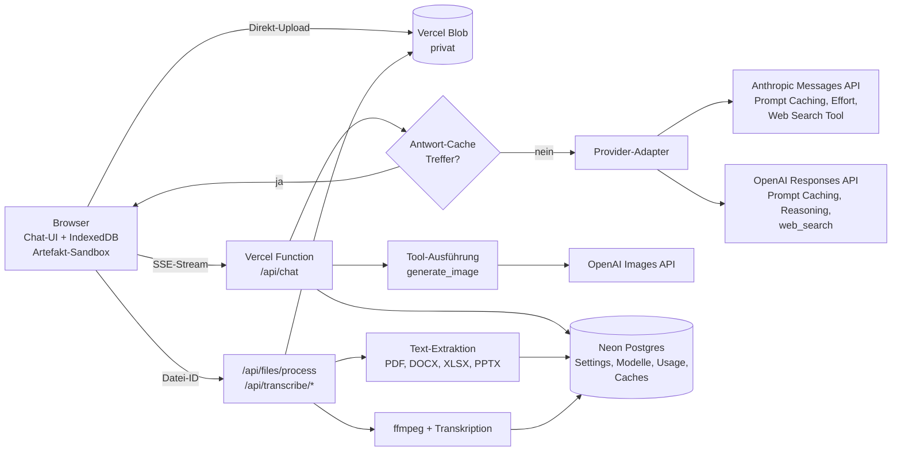

# Freebie – Umsetzungsplan

**Freebie** ist ein passwortgeschützter Chatbot für Schulungen. Teilnehmende brauchen kein eigenes
ChatGPT- oder Claude-Konto: Sie öffnen eine URL, geben das Schulungspasswort ein und arbeiten mit
den Modellen von OpenAI und Anthropic (Claude), die im Admin-Bereich freigegeben sind. Die API-Kosten
laufen zentral über die eigenen Schlüssel. Deshalb ist **Caching** ein Grundprinzip der Architektur
und kein späteres Add-on.

Freebie ist ausdrücklich eine **Spiel- und Übungsumgebung**. Die Anwendung selbst läuft auf **Vercel**,
die Verarbeitung erfolgt bei OpenAI und Anthropic in den USA. Darauf weist die App sichtbar hin (siehe F13).

### Festgelegte Rahmenbedingungen

| Thema | Entscheidung |
|-------|--------------|
| Hosting | Vercel (Team „StefanAI“), Region USA ist in Ordnung |
| Chatverlauf | Nur im Browser der Teilnehmenden |
| Standardmodell | **Claude Sonnet 5.5** mit Thinking-Effort **„Mittel“** |
| Nutzungslimits | **Keine** (keine Budgets, keine Quoten pro Person) |
| Design | Orientiert am Internetauftritt von StefanAI (stefanai.de) |
| Antwort-Cache für identische Anfragen | **Aktiv** |

---

## 1. Funktionsumfang

| # | Funktion | Kurzbeschreibung | Phase |
|---|----------|------------------|-------|
| F1 | Passwortschutz | Ein festes Passwort für den ganzen Chatbot, ein separates für den Admin-Bereich | 1 |
| F2 | Modellauswahl | Dropdown mit den im Admin freigegebenen OpenAI- und Claude-Modellen, Standard ist Claude Sonnet 5.5 | 1 |
| F3 | Chat-Grundfunktionen | Streaming, Markdown, Code-Highlighting, Formeln, Kopieren, Stopp, Neu generieren, Bearbeiten, Verlauf, Suche, Export | 1 |
| F4 | Admin-Bereich | Modelle pflegen, Funktionen an- und abschalten, Assistenten-Vorlagen, Hinweistext, Nutzungs- und Kosten-Dashboard | 2 |
| F5 | Thinking-Effort | Regler Niedrig / **Mittel** / Hoch / Maximal, optional mit Anzeige des Gedankengangs | 3 |
| F6 | Websuche | Schalter „Websuche“, Antworten mit Quellenangaben | 3 |
| F7 | Datei-Upload | PDF, DOCX, XLSX/XLS/CSV, PPTX, TXT/MD und Bilder (per Drag & Drop oder Einfügen) | 4 |
| F8 | MP3-Transkription | Audiodateien hochladen, transkribieren und anschließend damit weiterarbeiten | 5 |
| F9 | Spracheingabe | Mikrofon-Button, Diktat wird ins Eingabefeld übernommen und kann vor dem Senden bearbeitet werden | 5 |
| F10 | Bildgenerierung | Bilder erzeugen und mit Referenzbild bearbeiten, aus dem Chat heraus oder per Bild-Modus | 6 |
| F11 | Artefakte | HTML-Seiten, SVG, Mermaid-Diagramme und Charts in einem Seitenpanel mit Live-Vorschau | 7 |
| F12 | Caching und Kostentransparenz | Prompt Caching, Antwort-Cache, Hash-Caches, Dashboard mit Kosten und Ersparnis | 1 bis 8 |
| F13 | Hinweis „Spielumgebung“ | Gut sichtbarer Hinweis auf Login-Seite, beim ersten Start und in der Fußzeile | 1 |

---

## 2. Architektur und Tech-Stack

### 2.1 Entscheidungen

| Bereich | Wahl | Begründung |
|---------|------|------------|
| Framework | **Next.js** (App Router, TypeScript) | Läuft nativ auf Vercel, Frontend und API in einem Projekt, Streaming per Route Handler |
| Hosting | **Vercel** mit Fluid Compute, Funktionsregion USA Ost (`iad1`) | Kurzer Weg zu den APIs von OpenAI und Anthropic. Git-Push ergibt automatische Preview- und Produktions-Deployments |
| UI | Tailwind CSS + shadcn/ui, lucide-Icons, Design-Tokens im StefanAI-Look | Modernes, schickes UI ohne viel Eigenbau, Hell- und Dunkelmodus |
| LLM-Anbindung | **Offizielle SDKs**: `@anthropic-ai/sdk` und `openai` | Provider-Features wie `cache_control`, Effort, Server-Tools und Thinking-Blöcke sind nur nativ sauber nutzbar. Kein KI-Gateway und keine Abstraktionsschicht eines Drittanbieters |
| OpenAI-API | **Responses API** | Pflicht für Tool-Nutzung bei aktuellen GPT-Modellen, eingebaute Websuche, Reasoning-Steuerung |
| Datenbank | **Neon Postgres** über den Vercel Marketplace, Drizzle ORM | Serverless-tauglich (SQLite geht auf Vercel nicht, weil das Dateisystem flüchtig ist). Verbindungs-Pool mit `attachDatabasePool` aus `@vercel/functions` |
| Dateien | **Vercel Blob** (private Speicherung) | Uploads, Audio, generierte Bilder. Der Browser lädt **direkt** in Blob hoch, siehe 2.4 |
| Chatverlauf | **Im Browser** (IndexedDB über Dexie) | Kein Account nötig, Export und Import möglich |
| Audio | `ffmpeg-static` in der Transkriptions-Funktion, Arbeitsverzeichnis `/tmp` | Komprimieren und Aufteilen großer Dateien (OpenAI-Limit: 25 MB pro Transkriptionsanfrage) |
| Auth | Signierte HttpOnly-Cookies (`jose`), Next.js-Proxy (`proxy.ts`, früher `middleware.ts`) | Schützt alle Seiten **und** alle API-Routen |
| Hintergrundjobs | Vercel Cron (täglich) | Löscht abgelaufene Blobs und Cache-Einträge |
| Validierung | `zod` | Request-Bodies, Admin-Formulare, Tool-Eingaben |
| Tests | Vitest (Unit), Playwright (E2E gegen Preview-Deployments) | — |

### 2.2 Überblick



### 2.3 Provider-Adapter (Kernstück)

Ein internes, provider-neutrales Format für Nachrichten und Stream-Events, plus je ein Adapter:

```ts
interface ChatProvider {
  stream(req: NeutralChatRequest): AsyncIterable<NeutralEvent>;
}

type NeutralEvent =
  | { type: "text-delta"; text: string }
  | { type: "thinking-delta"; text: string }        // zusammengefasster Gedankengang
  | { type: "tool-status"; tool: "web_search" | "generate_image"; state: "running" | "done" }
  | { type: "citation"; url: string; title: string }
  | { type: "image"; id: string; url: string }
  | { type: "usage"; input: number; output: number; cacheRead: number; cacheWrite: number }
  | { type: "provider-blocks"; blocks: unknown }   // native Blöcke für den unveränderten Replay
  | { type: "cache-hit"; source: "answer-cache" }  // Antwort kam aus dem Antwort-Cache
  | { type: "error"; message: string }
  | { type: "done"; stopReason: string };
```

- Jede gespeicherte Assistenten-Nachricht enthält **beide Darstellungen**: den neutralen Text für UI
  und Export sowie die **nativen Provider-Blöcke** (inklusive Thinking-Blöcken mit Signatur bzw.
  verschlüsselter Reasoning-Items). Bleibt das Modell gleich, gehen die nativen Blöcke **byte-genau**
  zurück an die API. Das ist Voraussetzung für Prompt Caching und für das „Preserved Thinking“
  aktueller Claude-Modelle (siehe 4.1).
- Wechselt das Modell mitten im Gespräch, wird die Historie aus dem neutralen Format neu aufgebaut.
  Die UI weist darauf hin, dass der Cache dann neu startet.
- Capability-Flags pro Modell kommen aus dem Admin-Bereich (Vision, PDF, Websuche, Effort-Stufen,
  max. Output). Die UI blendet Funktionen aus, die das gewählte Modell nicht kann.

### 2.4 Vercel-spezifische Punkte

- **Uploads umgehen das Body-Limit.** Vercel Functions nehmen höchstens 4,5 MB Request-Body an.
  Dateien gehen deshalb per `upload()` aus `@vercel/blob/client` direkt vom Browser in Blob, bei
  großen Audiodateien mit `multipart: true` und Fortschrittsanzeige. Die Route `/api/upload/token`
  (`handleUpload`) prüft vorher das Sitzungs-Cookie, erlaubte Dateitypen und die Höchstgröße. Danach
  bekommt der Server nur noch die Blob-Referenz.
- **Private Blobs.** Uploads und generierte Bilder liegen mit `access: "private"` in Blob und werden
  ausschließlich über eine authentifizierte Route (`/api/files/[id]`) ausgeliefert.
- **Laufzeiten.** `maxDuration` wird für `/api/chat` und die Transkriptions-Routen auf das Maximum
  des Pro-Tarifs gesetzt (mit Fluid Compute bis zu 800 s, beim Setup prüfen). Antworten auf Stufe
  „Maximal“ mit Websuche können mehrere Minuten dauern.
- **Lange Audiodateien** laufen deshalb **in Etappen** statt in einer einzigen langen Funktion (siehe F8).
- **ffmpeg** kommt als `ffmpeg-static`-Binary in das Funktions-Bundle (über
  `outputFileTracingIncludes` in `next.config.ts`) und arbeitet in `/tmp`. Falls das Bundle-Limit
  Probleme macht: MP3-Dateien lassen sich auch ohne Neukodierung an Frame-Grenzen teilen, oder das
  Aufteilen läuft in einer Vercel Sandbox.
- **Umgebungsvariablen** stehen in den Vercel-Projekteinstellungen, lokal per `vercel env pull`.
- **Tarif:** Vercel Hobby ist nur für nicht-kommerzielle Nutzung gedacht. Für Schulungen braucht es
  den Pro-Tarif. Das Team StefanAI sollte darauf laufen, beim Anlegen des Projekts prüfen.

---

## 3. Funktionen im Detail

### F1 – Passwortschutz

- `APP_PASSWORD` (Teilnehmende) und `ADMIN_PASSWORD` (Admin) sind Vercel-Umgebungsvariablen.
  Optional lässt sich das App-Passwort im Admin-Bereich ändern, um es pro Schulung zu wechseln. Es wird
  dann gehasht (argon2) in der DB gespeichert, die Umgebungsvariable dient als Startwert.
- Der Vergleich erfolgt in konstanter Zeit. Nach erfolgreichem Login wird ein signiertes Cookie gesetzt
  (`HttpOnly`, `Secure`, `SameSite=Lax`, 12 h gültig; das Admin-Cookie hat einen eigenen Scope und
  gilt 2 h).
- `proxy.ts` schützt alle Routen außer `/login` und statischen Assets, also auch `/api/*`.
- Brute-Force-Schutz **nur für den Login** über Vercel Firewall (`checkRateLimit` aus
  `@vercel/firewall`). Das ist eine Sicherheitsmaßnahme und keine Nutzungsbegrenzung.
- Jede Browser-Sitzung erhält eine anonyme Sitzungs-ID (Zufallswert im Cookie). Sie dient der
  Statistik, ohne Personenbezug.

### F2 – Modellauswahl und F4 – Admin-Bereich

**Modelle (Tabelle `models`)**: Provider, API-Modell-ID, Anzeigename, Beschreibung („gut für Texte“,
„schnell & günstig“), aktiv/inaktiv, Standardmodell, Reihenfolge, Fähigkeiten (Vision, PDF nativ,
Websuche), angebotene Effort-Stufen und deren Mapping, Standard-Effort, max. Output-Tokens sowie Preise
pro 1 Mio. Tokens (Input, Output, Cache-Read, Cache-Write) für die Kostenanzeige.

- Der Button „Modelle abrufen“ lädt die verfügbaren Modelle über die Models-Endpunkte beider Anbieter.
  Neue Modelle lassen sich dann mit einem Klick übernehmen. Modell-IDs werden nie im Code fest verdrahtet.
- **Startbelegung (Seed):**
  - **Claude Sonnet 5.5** als **Standard**, Effort „Mittel“
  - Claude Opus 5.5 für anspruchsvolle Aufgaben
  - Claude Haiku 5.5, schnell und günstig (auch für Chat-Titel)
  - das aktuelle GPT-Flaggschiff und ein günstiges GPT-Modell
  - die exakten API-IDs werden beim Seed per „Modelle abrufen“ übernommen

**Einstellungen (Tabelle `settings`)**:
- Funktionen global an/aus: Websuche, Datei-Upload, Transkription, Spracheingabe, Bildgenerierung,
  Artefakte, Antwort-Cache
- Modelle für Bilder (z. B. `gpt-image-2`), Transkription und Titelgenerierung
- Standardqualität und -größe für Bilder
- Cache-TTL für Claude (5 Min. Standard oder 1 h) und Gültigkeit des Antwort-Caches (Standard 24 h)
- Text des Hinweises „Spielumgebung“ (F13)
- **Not-Aus:** Chatbot pausieren, z. B. falls das Passwort die Runde macht. Zusätzlich lässt sich das
  App-Passwort sofort wechseln.
- Globaler System-Prompt-Zusatz (versioniert, siehe Abschnitt 4)

**Es gibt keine Nutzungslimits**: kein Tagesbudget, keine Anfragen- oder Bildquoten, keine
Effort-Sperren. Es bleiben nur technische Grenzen wie das Kontextfenster eines Modells. Die App
behandelt sie mit klaren Hinweisen statt stillem Abschneiden.

**Assistenten-Vorlagen (Tabelle `presets`)**, z. B. „E-Mail-Profi“, „Excel-Erklärer“,
„Präsentations-Coach“: Name, Icon, Zusatz-Prompt, empfohlenes Modell. Teilnehmende wählen sie beim
Start eines neuen Chats.

**Dashboard (Kostentransparenz)**: Anfragen, Tokens und Kosten pro Tag und Modell, **Cache-Trefferquote**
(gelesene Cache-Tokens im Verhältnis zum gesamten Input), **Ersparnis durch Prompt Caching und
Antwort-Cache in €**, Bilder und Transkriptionsminuten, aktive Sitzungen.

**API-Schlüssel** bleiben ausschließlich in Umgebungsvariablen (`ANTHROPIC_API_KEY`,
`OPENAI_API_KEY`). Der Admin-Bereich zeigt nur den Status (konfiguriert ja/nein) und einen Button
„Verbindung testen“.

### F3 – Chat-Grundfunktionen

- Antworten werden per Server-Sent Events gestreamt. Eine Abbruch-Taste beendet die Generierung.
- Darstellung: Markdown (GFM-Tabellen), Code mit Shiki und Kopier-Button, Formeln mit KaTeX.
- Nachrichten lassen sich kopieren, neu generieren und **bearbeiten**. Bearbeiten erzeugt eine neue
  Verzweigung ab dieser Stelle: Der Präfix davor bleibt unverändert. Das hält den Cache intakt und ist
  mit Preserved Thinking kompatibel.
- Seitenleiste mit Chatverlauf: umbenennen, löschen, durchsuchen. Titel erzeugt automatisch Claude
  Haiku 5.5.
- Chats lassen sich als Markdown, PDF (Druckansicht) oder JSON exportieren und als JSON wieder importieren.
- Deutsche Oberfläche, Hell- und Dunkelmodus, mobil nutzbar, Tastenkürzel (Enter senden,
  Shift+Enter Zeilenumbruch, Strg+K neuer Chat).
- Optional zeigt jede Antwort Tokens und Kosten an (im Admin abschaltbar).
- Fehler werden verständlich erklärt. Lehnt ein Modell aus Sicherheitsgründen ab
  (`stop_reason: "refusal"`), zeigt die App einen freundlichen Hinweis. Bei Claude ist der
  serverseitige Fallback aktiviert (`fallbacks: "default"`, Beta-Header
  `server-side-fallback-2026-07-01`). Bei Sonnet 5.5 greift er für bestimmte Ablehnungskategorien
  und weicht dann auf ein anderes Claude-Modell aus.

### F5 – Thinking-Effort

Ein Regler in der Eingabeleiste mit vier Stufen, **Standard „Mittel“**. Das Mapping ist pro Modell im
Admin-Bereich hinterlegt, weil die Stufen je nach Modell abweichen:

| UI-Stufe | Claude (`output_config.effort`) | OpenAI (`reasoning.effort`) |
|----------|--------------------------------|-----------------------------|
| Niedrig | `low` | `low` (bzw. `none`, wo unterstützt) |
| **Mittel** (Standard) | `medium` | `medium` |
| Hoch | `high` | `high` |
| Maximal | `max` | `xhigh` / `max` |

- **Effort wird immer explizit gesendet.** Claude Sonnet 5.5 nutzt ohne Angabe `high`, nicht „Mittel“.
- Claude: `thinking: { type: "adaptive", display: "summarized" }`. Ohne `display: "summarized"`
  kommen bei aktuellen Modellen leere Thinking-Blöcke, und die UI wirkt wie eingefroren. Bei Sonnet 5.5
  lässt sich Thinking nicht per `disabled` abschalten, „Niedrig“ ist die sparsamste Stufe.
- OpenAI: `reasoning: { effort, summary: "auto" }`.
- Die UI zeigt den Gedankengang als einklappbaren Block „Freebie denkt nach …“.
- Bei „Hoch“ und „Maximal“ wird `max_tokens` großzügig gesetzt (mindestens 64 000), sonst bricht die
  Antwort mitten im Denken ab. Es wird immer gestreamt.
- **Caching-Hinweis:** Bei Claude macht ein geänderter Effort auf oberster Ebene den Nachrichten-Cache
  ungültig. Ändert jemand die Stufe mitten im Gespräch, sendet die App deshalb eine
  Mid-Conversation-System-Nachricht (`role: "system"`, `content: []`, `output_config: { effort }`;
  Beta `mid-conversation-output-config-2026-07-01`, von Sonnet 5.5 unterstützt). So bleibt der Cache
  erhalten.

### F6 – Websuche

- Claude: Server-Tool `web_search_20260209` (mit dynamischer Filterung), dazu bei Bedarf
  `web_fetch_20260209`. Antworten mit `stop_reason: "pause_turn"` werden automatisch fortgesetzt.
  Fehler kommen als Ergebnisblock und nicht als Exception, der Code prüft das gezielt.
- OpenAI: eingebautes Tool `web_search` der Responses API.
- Die UI zeigt den Status „Suche im Web …“ und am Ende die Quellen als Karten (Titel, Domain, Link).
- **Caching:** Die Tool-Liste ist Teil des Cache-Präfixes. Sie wird deshalb **zu Beginn eines
  Gesprächs vollständig und deterministisch sortiert** festgelegt (alle im Admin aktivierten Tools).
  Den Schalter „Websuche aus“ setzt die App als kurze Anweisung **hinter** dem Cache-Breakpoint um,
  bei Claude als Mid-Conversation-System-Nachricht. Alternativ kommen die Beta-Blöcke
  `tool_addition`/`tool_removal` in Frage. Die Tool-Liste wird nicht mitten im Gespräch umgebaut.

### F7 – Datei-Upload

| Format | Verarbeitung |
|--------|--------------|
| PDF | Textextraktion (`unpdf`). Optional werden PDFs nativ als `document`-Block an Claude bzw. als `input_file` an OpenAI geschickt, wenn Layout und Grafiken wichtig sind (Schalter im Admin) |
| DOCX | `mammoth` → Markdown (Überschriften, Listen, Tabellen) |
| XLSX / XLS / CSV / ODS | SheetJS → pro Tabellenblatt eine Markdown- bzw. CSV-Tabelle, dazu Zeilen- und Spaltenzahl. Sehr große Blätter werden **nicht still abgeschnitten**, die UI weist auf das Kontextfenster hin und bietet eine Auswahl an |
| PPTX | `officeparser` → Text pro Folie |
| TXT, MD, JSON, Code | direkt |
| PNG, JPG, WEBP, GIF | Vision-Content-Block (verkleinert auf eine sinnvolle Maximalgröße) |

- Ablauf: Direkt-Upload in Vercel Blob (siehe 2.4), danach `/api/files/process`. Der Server prüft
  MIME-Typ und Dateisignatur und schützt vor Zip-Bomben (DOCX, XLSX und PPTX sind ZIP-Dateien).
- Vor dem Senden zeigt die App eine Token-Schätzung („Diese Datei entspricht ca. 18 000 Tokens“) und
  warnt, wenn das Kontextfenster des Modells knapp wird.
- **Caching:** Das Extraktionsergebnis wird unter dem SHA-256 der Datei gespeichert. Laden 20
  Teilnehmende dieselbe Übungsdatei hoch, wird sie nur einmal verarbeitet. Der Dateiinhalt steht im
  Gespräch an der Stelle, an der er hochgeladen wurde, und gehört ab dann zum gecachten Präfix. Für
  alle Folgefragen wird er also günstig aus dem Prompt-Cache gelesen.
- Die Dateien selbst liegen mit TTL (Standard 7 Tage) in Blob, der Chat verweist nur auf ihre ID.

### F8 – MP3-Transkription

Erlaubt sind mp3, m4a, wav, webm, ogg und mp4-Audio, ohne Längenbegrenzung. Der Ablauf ist in Etappen
geteilt, damit keine einzelne Vercel Function an ihr Zeitlimit kommt:

1. **Upload:** Der Browser lädt die Datei direkt per Multipart in Vercel Blob, mit Fortschrittsbalken.
2. **Cache-Prüfung:** `/api/transcribe/start` berechnet den SHA-256. Gibt es dazu schon ein Transkript,
   ist es sofort fertig.
3. **Vorbereiten:** Sonst wandelt `ffmpeg` die Datei in Mono, 16 kHz, niedrige Bitrate um und teilt sie
   in Abschnitte von etwa 10 Minuten und unter 25 MB (mit kurzer Überlappung). Die Abschnitte landen
   wieder in Blob.
4. **Transkribieren:** Der Browser ruft `/api/transcribe/chunk` für die Abschnitte auf, mehrere
   parallel. Jede Funktion schickt einen Abschnitt an die OpenAI-Transkription. Das Modell ist im
   Admin wählbar, z. B. `gpt-4o-transcribe`, `gpt-4o-mini-transcribe` oder `whisper-1`.
5. **Zusammenfügen:** `/api/transcribe/finish` fügt die Teile zusammen, speichert das Transkript im
   Cache und legt es als Anhang „Transkript.md“ in den Chat. Darunter stehen Buttons wie
   „Zusammenfassen“, „Protokoll erstellen“ und „To-dos extrahieren“.

- **Caching:** Das Transkript wird unter dem SHA-256 der Originaldatei und der Modell-ID gespeichert.
  Laden alle Teilnehmenden dieselbe Beispiel-MP3 hoch, wird sie **einmal statt zwanzigmal** bezahlt.

### F9 – Spracheingabe

- Ein Mikrofon-Button nimmt per `MediaRecorder` auf (webm/opus) und zeigt Pegel und Timer. Ein
  zweiter Klick beendet die Aufnahme.
- Kurze Diktate (unter 4 MB) gehen direkt an `/api/transcribe/dictate`, längere über Blob wie in F8.
  Der Text landet **im Eingabefeld** und wird nicht direkt gesendet, damit Teilnehmende ihn
  korrigieren können.
- Die Browser-Spracherkennung (Web Speech API) ist bewusst **nicht** Standard. Sie funktioniert nur
  in manchen Browsern und schickt Audio an Dritte. Sie bleibt höchstens als optionaler Fallback.

### F10 – Bildgenerierung

- Ein eigenes Funktions-Tool `generate_image(prompt, size, quality, reference_image_ids?)` steht
  **beiden** Anbietern zur Verfügung. Auch Claude kann also Bilder erzeugen, wenn man im Chat
  „Mach mir ein Bild von …“ schreibt. Die Tool-Definition nutzt `strict: true`. Der Server führt das
  Tool aus und ruft die OpenAI Images API auf (`images.generate`, bei Referenzbildern `images.edit`,
  Modell aus dem Admin, z. B. `gpt-image-2`).
- Zusätzlich gibt es einen Button „Bild-Modus“, der direkt generiert, ohne Umweg über ein Chatmodell.
  Teilnehmende wählen dort Format und Qualität, Standard ist „medium“.
- Bilder liegen privat in Vercel Blob (TTL), mit Download-Button und „Weiter bearbeiten“.
- Generierte Bilder werden bewusst **nicht** aus dem Antwort-Cache bedient. Gibt die ganze Gruppe
  denselben Bild-Prompt ein, bekommt jede Person ihr eigenes Bild, und die Variation wird sichtbar.

### F11 – Artefakte

- Der System-Prompt beschreibt ein festes Format, das beide Anbieter gleich ausgeben:

  ```
  <artifact id="umsatz-chart" type="html" title="Umsatzentwicklung 2025">
  ...vollständiger Code...
  </artifact>
  ```

  Unterstützte Typen sind `html` (inkl. CSS/JS, Charts mit Chart.js), `svg`, `mermaid`,
  `markdown` und `code`.
- Der Client erkennt Artefakte schon während des Streamings und öffnet ein **Seitenpanel** mit den
  Tabs Vorschau, Code, Kopieren, Download (.html/.svg/.png) und „In neuem Tab öffnen“.
- Gleiche `id` in einer späteren Antwort ergibt eine **neue Version**, zwischen der man umschalten kann.
- Sicherheit: HTML läuft in einem `iframe` mit `srcdoc` und `sandbox="allow-scripts allow-downloads"`
  (ohne `allow-same-origin`, also kein Zugriff auf Cookies oder die App). Eine CSP erlaubt nur Skripte
  von freigegebenen CDNs (cdnjs, jsdelivr). Mermaid läuft mit `securityLevel: "strict"`, SVG wird mit
  DOMPurify bereinigt.
- In Ausbaustufe 2 kommen React-Artefakte hinzu (Transpilieren im Browser).

### F13 – Hinweis „Spielumgebung“

Der Hinweis erscheint an drei Stellen:

1. auf der **Login-Seite**, direkt unter dem Passwortfeld
2. als **Dialog beim ersten Start** im Browser, mit „Verstanden“
3. dauerhaft in der **Fußzeile des Chats** als Kurzform, mit Link zum vollständigen Text

Vorschlag für den Text (im Admin editierbar):

> **Freebie ist eine Spiel- und Übungsumgebung für unsere Schulungen.** Alle Eingaben, Dateien und
> Sprachaufnahmen werden zur Verarbeitung an OpenAI und Anthropic in den USA übertragen. Die Anwendung
> läuft bei Vercel (USA). Identische Anfragen können zur Kostenersparnis aus einem gemeinsamen
> Zwischenspeicher beantwortet werden. Bitte gib keine personenbezogenen, vertraulichen oder
> geschäftskritischen Daten ein.

Kurzform für die Fußzeile: „Spielumgebung – bitte keine vertraulichen oder personenbezogenen Daten eingeben.“

---

## 4. Caching-Strategie (Budget schonen)

Caching wirkt auf zwei Ebenen. Hinzu kommt ein Dashboard, das die Wirkung sichtbar macht.

### 4.1 Ebene A – Prompt Caching der Anbieter

**Grundregel bei beiden Anbietern:** Gecacht wird ein **Präfix**. Jede Änderung an einer Stelle macht
alles danach ungültig. Die Reihenfolge ist `tools` → `system` → `messages`. Daraus folgen diese
Architekturregeln, die im Code durchgesetzt und getestet werden:

1. **Der System-Prompt ist eingefroren und versioniert** (`lib/prompts/system.ts`, Version im Hash).
   Er enthält kein Datum, keine Uhrzeit, keinen Namen und keine Sitzungs-ID. Das **Datum (ohne
   Uhrzeit)** kommt als kurzer Kontextblock in die *jeweils neue* User-Nachricht. Alle Teilnehmenden
   teilen sich damit denselben gecachten System- und Tool-Präfix: Die erste Anfrage schreibt den Cache,
   alle weiteren lesen. Weil die Uhrzeit fehlt, sind identische Anfragen am selben Tag auch für den
   Antwort-Cache identisch (4.2).
2. **Die Tool-Liste ist deterministisch**, sortiert und pro Gespräch fest (siehe F6).
3. **Die Historie ist append-only.** Frühere Nachrichten werden nie umgeschrieben, gekürzt oder neu
   formatiert. Native Provider-Blöcke (inkl. Thinking) gehen byte-genau zurück. „Bearbeiten“ heißt
   Verzweigen ab einem Präfix. Bei Claude Sonnet 5.5 und den anderen aktuellen Claude-Modellen ist
   das zusätzlich **Pflicht**: Für neue API-Konten beantwortet die API eine nachträglich veränderte
   Historie mit einem Fehler 400 („Preserved Thinking“).
4. **Kein Modellwechsel mitten im Chat ohne Hinweis.** Caches gelten pro Modell.
5. **JSON wird stabil serialisiert** (sortierte Schlüssel), keine Zufalls-IDs im Präfix.

**Claude (Anthropic)**
- Ein expliziter Breakpoint `cache_control: { type: "ephemeral" }` sitzt auf dem letzten
  System-Block. Damit sind Tools und System-Prompt gemeinsam gecacht.
- Ein zweiter Breakpoint sitzt am Ende des Assistenten-Vorlagen-Zusatzes, falls eine Vorlage aktiv ist.
- Für den wachsenden Gesprächsteil ist automatisches Caching aktiv (`cache_control` auf oberster
  Ebene). Jede Anfrage liest den gesamten bisherigen Verlauf aus dem Cache und schreibt nur den neuen Teil.
- Die TTL ist standardmäßig 5 Minuten (Cache-Writes kosten das 1,25-Fache, Reads ein Zehntel des
  Input-Preises). Für Übungsphasen mit längeren Pausen lässt sich im Admin 1 h wählen (Write 2-fach,
  lohnt sich ab etwa drei Anfragen pro Stunde).
- Der System-Prompt ist mit Artefakt-Protokoll und Tool-Hinweisen deutlich länger als das
  Cache-Minimum aktueller Modelle (512 Tokens) und wird daher zuverlässig gecacht.

**OpenAI**
- Ab etwa 1 024 Tokens Präfix wird automatisch gecacht. Derselbe stabile Präfix-Aufbau wie bei Claude
  gilt auch hier.
- Mit `prompt_cache_key` (pro Gespräch bzw. pro System-Prompt-Version) landen zusammengehörige
  Anfragen auf derselben Maschine.
- Neuere GPT-Modelle bieten zusätzlich explizite Breakpoints und Cache-TTL-Optionen. Bei der
  Umsetzung werden sie gegen die aktuelle Doku geprüft und eingesetzt, wo sie verfügbar sind.
- Die Anfragen sind zustandslos (`store: false`). Reasoning-Items gehen verschlüsselt zurück
  (`include: ["reasoning.encrypted_content"]`), damit der Kontext ohne Speicherung bei OpenAI
  erhalten bleibt.

**Messen statt hoffen**
- Jede Anfrage protokolliert die Usage-Felder: bei Claude `cache_read_input_tokens`,
  `cache_creation_input_tokens` und `input_tokens`, bei OpenAI `input_tokens_details.cached_tokens`.
  Das Dashboard zeigt daraus die Trefferquote.
- Ein Integrationstest (läuft gegen die echte API, manuell bzw. nightly) prüft, dass die zweite
  Anfrage eines Gesprächs `cache_read > 0` meldet. So fällt eine Caching-Regression sofort auf
  und nicht erst auf der Rechnung.

### 4.2 Ebene B – App-eigene Caches

| Was | Schlüssel | Effekt in Schulungen |
|-----|-----------|----------------------|
| **Antwort-Cache (aktiv)** | Hash aus Modell-ID, System-Prompt-Version, Vorlage, Effort, Tool-Set, Websuche an/aus und dem **gesamten bisherigen Gesprächsverlauf** inkl. Datum und Datei-Hashes | Tippen 20 Leute denselben Übungsprompt, wird nur einmal bezahlt. Weil der ganze Verlauf im Schlüssel steckt, greift er auch bei identischen Folgefragen in angeleiteten Übungen |
| Transkripte | SHA-256(Audio) + Modell | Dieselbe Übungs-MP3 wird nur einmal transkribiert |
| Datei-Extraktion | SHA-256(Datei) | Übungsdateien werden nur einmal geparst |
| Chat-Titel | — | Titel erzeugt Claude Haiku 5.5 mit kurzem Prompt |

**Details zum Antwort-Cache**
- Bei einem Treffer wird die gespeicherte Antwort zügig „abgespielt“, damit sich die Oberfläche wie
  gewohnt verhält. Ein kleines Abzeichen „⚡ aus dem Cache“ macht das transparent (im Admin
  ausblendbar).
- **„Neu generieren“ umgeht den Cache immer.** Die neue Antwort überschreibt den Eintrag nicht, die
  erste Antwort bleibt die gemeinsame.
- Die Gültigkeit beträgt standardmäßig 24 h und ist im Admin einstellbar. Weil das Datum im Schlüssel
  steckt, gibt es höchstens Treffer vom selben Tag. Das ist wichtig für Antworten mit Websuche.
- Antworten mit generierten Bildern werden nicht gecacht (siehe F10).
- Der Antwort-Cache speichert die nativen Provider-Blöcke mit. Setzt eine zweite Person das Gespräch
  fort, ist ihr Verlauf byte-identisch zur ersten. Thinking-Signaturen bleiben gültig, und der
  Prompt-Cache des Anbieters greift ebenfalls.
- Der Antwort-Cache ist der einzige Ort, an dem Gesprächsinhalte auf dem Server liegen. Der Hinweis
  „Spielumgebung“ erwähnt das, und abgelaufene Einträge löscht der tägliche Cron-Job.

### 4.3 Kostentransparenz statt Limits

Es gibt keine Budgets und keine Quoten. Stattdessen:
- zeigt das Dashboard Kosten pro Tag und Modell, die Cache-Trefferquote und die **Ersparnis in €**
  durch Prompt Caching und Antwort-Cache
- gibt es für den Notfall den Not-Aus im Admin und die sofortige Passwortänderung (siehe F4)

### 4.4 Beispielrechnung (grob, Listenpreise Stand Oktober 2026)

Annahme: 20 Teilnehmende × 25 Anfragen mit **Claude Sonnet 5.5** ($2 Input / $10 Output pro 1 Mio.
Tokens, Cache-Read $0.20, Cache-Write $2.50), im Schnitt 10 000 Input-Tokens pro Anfrage (davon ca.
1 000 neu) und 800 Output-Tokens.

| | Input | Output | Summe |
|---|---|---|---|
| Ohne Caching | 5 Mio. × $2 = **$10.00** | **$4.00** | **$14.00** |
| Mit Prompt Caching | 4,5 Mio. × $0.20 + 0,5 Mio. × $2.50 = **$2.15** | **$4.00** | **$6.15** |

Die Input-Kosten sinken um etwa 78 %, die Gesamtkosten um mehr als die Hälfte. Je länger die Chats
und je größer die hochgeladenen Dateien, desto stärker wirkt das Caching. Jeder Treffer im
Antwort-Cache spart zusätzlich die komplette Anfrage samt Output. In angeleiteten Übungen, in denen
alle denselben Prompt eingeben, fällt dadurch ein Großteil der Kosten weg.

---

## 5. Design: StefanAI-Look

Freebie soll sich visuell am Internetauftritt von StefanAI (stefanai.de) orientieren.

- **Design-Tokens** als CSS-Variablen im Tailwind-Theme, jeweils für Hell- und Dunkelmodus:
  Primärfarbe, Akzentfarbe, Hintergrund, Flächen, Text und Rahmen.
- **Typografie:** dieselbe Schrift wie auf der Website (über `next/font`) bzw. eine passende Alternative.
- **Logo:** StefanAI-Logo und Wortmarke „Freebie“ (z. B. „Freebie by StefanAI“) im Header, auf der
  Login-Seite und als Favicon.
- **Formensprache:** Rundungen, Schatten, Button-Stil und Bildsprache wie auf der Website.
- **Tonalität:** Die Texte der Oberfläche (Begrüßung, leere Zustände, Fehlermeldungen) greifen den Ton
  der Website auf.
- Umsetzung in Phase 0 als kleines Design-System (`app/globals.css`, `tailwind`-Theme,
  shadcn-Komponenten), damit alle späteren Seiten automatisch passen.
- **Offen:** Die konkreten Werte (Hex-Farben, Schrift, Logo-Datei) werden beim Setup von stefanai.de
  übernommen.

---

## 6. Datenmodell (Neon Postgres)

```
settings          key TEXT PK, value JSONB, updated_at
models            id, provider, model_id, display_name, description, enabled, is_default,
                  sort_order, capabilities JSONB, effort_map JSONB, default_effort,
                  max_output_tokens, price_in, price_out, price_cache_read, price_cache_write
presets           id, name, icon, prompt_addendum, default_model_id, enabled, sort_order
usage_log         id, ts, session_hash, model_id, feature, input_tokens, output_tokens,
                  cache_read_tokens, cache_write_tokens, cost_usd, answer_cache_hit
uploads           id, blob_pathname, sha256, mime, size, created_at, expires_at
file_cache        sha256 PK, kind, extracted_text, token_estimate, created_at
transcript_cache  (sha256, model) PK, text, duration_sec, created_at
answer_cache      key_hash PK, model_id, neutral_answer JSONB, provider_blocks JSONB,
                  usage JSONB, hits, created_at, expires_at
images            id, blob_pathname, prompt, model, size, quality, session_hash, created_at, expires_at
```

Die Gesprächsinhalte selbst liegen im Browser (IndexedDB). Einzige Ausnahme ist der Antwort-Cache.
Der tägliche Vercel-Cron-Job löscht abgelaufene Blobs und Cache-Einträge.

---

## 7. Projektstruktur

```
freebie/
├─ app/
│  ├─ login/page.tsx
│  ├─ (chat)/page.tsx, (chat)/c/[id]/page.tsx
│  ├─ admin/{login,models,settings,presets,usage}/page.tsx
│  └─ api/
│     ├─ auth/{login,logout}/route.ts
│     ├─ chat/route.ts                  # SSE-Stream, Antwort-Cache, Tool-Loop
│     ├─ upload/token/route.ts          # handleUpload für Vercel Blob
│     ├─ files/process/route.ts         # Extraktion
│     ├─ files/[id]/route.ts            # Auslieferung privater Blobs mit Auth
│     ├─ transcribe/{start,chunk,finish,dictate}/route.ts
│     ├─ images/route.ts                # Bild-Modus
│     ├─ cron/cleanup/route.ts          # täglicher Aufräumjob
│     └─ admin/…                        # CRUD, Modelle abrufen, Verbindung testen
├─ lib/
│  ├─ providers/{types,anthropic,openai,index}.ts
│  ├─ prompts/system.ts                 # eingefroren + versioniert
│  ├─ tools/generate-image.ts
│  ├─ files/{pdf,docx,xlsx,pptx,image}.ts
│  ├─ audio/{ffmpeg,transcribe}.ts
│  ├─ cache/{hash,answer-cache,file-cache,transcript-cache}.ts
│  ├─ auth/{session,password}.ts
│  ├─ usage/{log,pricing}.ts
│  └─ db/{schema,client,seed}.ts
├─ components/{chat,artifacts,admin,ui}/
├─ proxy.ts                             # Auth für alle Routen
├─ next.config.ts                       # u. a. outputFileTracingIncludes für ffmpeg
├─ vercel.json                          # maxDuration, Cron
├─ tests/{unit,e2e}/
└─ .env.example                         # APP_PASSWORD, ADMIN_PASSWORD, SESSION_SECRET,
                                        # ANTHROPIC_API_KEY, OPENAI_API_KEY, DATABASE_URL,
                                        # BLOB_READ_WRITE_TOKEN, CRON_SECRET
```

---

## 8. Umsetzungsphasen

Jede Phase endet mit einem Deployment auf Vercel. Jeder Branch bekommt automatisch ein Preview-Deployment.

| Phase | Inhalt | Fertig, wenn … |
|-------|--------|----------------|
| **0 – Fundament** | Next.js-Projekt, Vercel-Projekt „freebie“ im Team StefanAI, Neon Postgres und Blob anlegen, Drizzle-Schema + Seed, **Design-System im StefanAI-Look**, Lint, Typecheck, Vitest, CI | Ein Push auf den Branch erzeugt ein Preview-Deployment mit leerer, gebrandeter App |
| **1 – Kern-Chat (MVP)** | Passwort-Gate, Hinweis „Spielumgebung“, Provider-Adapter für Claude und OpenAI mit Streaming, Modell-Dropdown (Standard Sonnet 5.5, Effort „Mittel“), Markdown-Rendering, Verlauf in IndexedDB, **Caching-Architektur nach 4.1**, **Antwort-Cache**, Usage-Logging | Man kann sich einloggen und mit beiden Anbietern chatten. Die zweite Nachricht zeigt Cache-Treffer im Log, eine identische Erstanfrage kommt aus dem Antwort-Cache |
| **2 – Admin** | Admin-Login, Modelle (CRUD, „Modelle abrufen“), Einstellungen, Not-Aus, Assistenten-Vorlagen, Dashboard mit Ersparnis, App-Passwort ändern | Ein neues Modell lässt sich ohne Code-Änderung freischalten |
| **3 – Effort + Websuche** | Effort-Regler mit Mapping und Effort-Wechsel ohne Cache-Verlust, Gedankengang-Anzeige, Websuche bei beiden Anbietern mit Quellenkarten | Antworten mit Quellen, „Maximal“ läuft ohne Abbruch |
| **4 – Dateien** | Direkt-Upload in Blob, Extraktion PDF/DOCX/XLSX/PPTX, Bilder (Vision), Token-Schätzung, Hash-Cache | Eine Excel-Datei über 4,5 MB lässt sich hochladen und befragen, Folgefragen sind gecacht |
| **5 – Audio** | MP3-Transkription in Etappen mit ffmpeg und Fortschritt, Transkript-Cache, Spracheingabe per Mikrofon | Eine 60-Minuten-MP3 wird vollständig transkribiert, der zweite Upload kommt sofort aus dem Cache |
| **6 – Bilder** | Tool `generate_image` für beide Anbieter, Bild-Modus, Bearbeiten mit Referenzbild | „Erstelle ein Bild von …“ funktioniert mit Claude und GPT |
| **7 – Artefakte** | Artefakt-Protokoll im System-Prompt, Streaming-Parser, Seitenpanel, Sandbox, Versionen, Download | Eine Landingpage und ein Chart werden live gerendert und lassen sich herunterladen |
| **8 – Härtung & Go-live** | Security-Review (Upload, Sandbox, Auth), E2E-Tests (Playwright gegen Preview), Last-Test, Produktions-Domain, Betriebsdoku | Last-Test mit 30 parallelen Sitzungen bestanden, Doku liegt vor |

---

## 9. Sicherheit

- API-Schlüssel existieren nur serverseitig. Der Browser spricht ausschließlich mit der eigenen API.
- Logs enthalten keine Gesprächsinhalte, nur Metadaten (Modell, Tokens, Kosten).
- Der Hinweis „Spielumgebung“ (F13) macht transparent, wo die Daten verarbeitet werden, und bittet
  darum, keine personenbezogenen oder vertraulichen Daten einzugeben.
- Uploads: Validierung von Typ, Signatur und Größe, Schutz vor Zip-Bomben, private Blobs, Auslieferung
  nur mit gültiger Sitzung, automatisches Löschen.
- Artefakte laufen in einer strikt isolierten Sandbox (siehe F11).
- Security-Header wie CSP, HSTS und `X-Frame-Options` für die App selbst. Der Cron-Endpunkt ist per
  `CRON_SECRET` geschützt.

---

## 10. Noch offen

1. **Branding-Werte:** Logo-Datei, Hex-Farben und Schrift von stefanai.de (siehe Abschnitt 5).
2. **Vercel-Tarif:** Bestätigen, dass das Team StefanAI auf Pro läuft (kommerzielle Nutzung, längere
   Funktionslaufzeiten).
