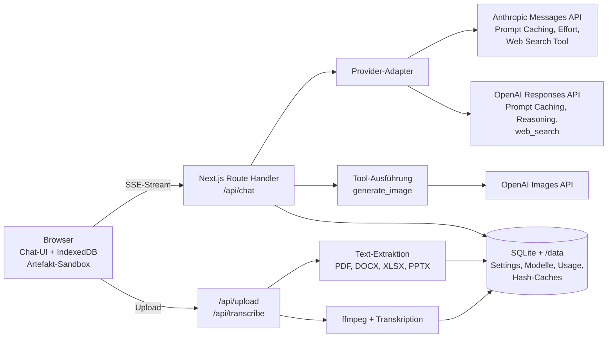

# Freebie – Umsetzungsplan

**Freebie** ist ein passwortgeschützter Chatbot für Schulungen. Teilnehmende brauchen kein eigenes
ChatGPT- oder Claude-Konto: Sie öffnen eine URL, geben das Schulungspasswort ein und arbeiten mit
den Modellen von OpenAI und Anthropic (Claude), die im Admin-Bereich freigegeben sind. Die API-Kosten
laufen zentral über die Schlüssel der Betreiberin bzw. des Betreibers. Deshalb ist **Caching** ein
Grundprinzip der Architektur und kein späteres Add-on.

---

## 1. Funktionsumfang

| # | Funktion | Kurzbeschreibung | Phase |
|---|----------|------------------|-------|
| F1 | Passwortschutz | Ein festes Passwort für den ganzen Chatbot, ein separates für den Admin-Bereich | 1 |
| F2 | Modellauswahl | Dropdown mit den im Admin freigegebenen OpenAI- und Claude-Modellen | 1 |
| F3 | Chat-Grundfunktionen | Streaming, Markdown, Code-Highlighting, Formeln, Kopieren, Stopp, Neu generieren, Bearbeiten, Verlauf, Suche, Export | 1 |
| F4 | Admin-Bereich | Modelle pflegen, Funktionen an- und abschalten, Limits, Assistenten-Vorlagen, Nutzungs- und Kosten-Dashboard | 2 |
| F5 | Thinking-Effort | Regler für die Denktiefe (Schnell / Ausgewogen / Gründlich / Maximal), optional mit Anzeige des Gedankengangs | 3 |
| F6 | Websuche | Schalter „Websuche“, Antworten mit Quellenangaben | 3 |
| F7 | Datei-Upload | PDF, DOCX, XLSX/XLS/CSV, PPTX, TXT/MD und Bilder (per Drag & Drop oder Einfügen) | 4 |
| F8 | MP3-Transkription | Audiodateien hochladen, transkribieren und anschließend damit weiterarbeiten | 5 |
| F9 | Spracheingabe | Mikrofon-Button, Diktat wird ins Eingabefeld übernommen und kann vor dem Senden bearbeitet werden | 5 |
| F10 | Bildgenerierung | Bilder erzeugen und mit Referenzbild bearbeiten, aus dem Chat heraus oder per Bild-Modus | 6 |
| F11 | Artefakte | HTML-Seiten, SVG, Mermaid-Diagramme und Charts in einem Seitenpanel mit Live-Vorschau | 7 |
| F12 | Kostenschutz | Tagesbudget, Rate-Limits, Größenlimits und Caching-Kennzahlen | 1 bis 8 |

---

## 2. Architektur und Tech-Stack

### 2.1 Entscheidungen

| Bereich | Wahl | Begründung |
|---------|------|------------|
| Framework | **Next.js** (App Router, TypeScript), Node.js LTS | Frontend und API in einem Projekt, Streaming per Route Handler, große Community |
| UI | Tailwind CSS + shadcn/ui, lucide-Icons | Modernes, schickes UI ohne viel Eigenbau, Dark Mode inklusive |
| LLM-Anbindung | **Offizielle SDKs**: `@anthropic-ai/sdk` und `openai` | Provider-Features wie `cache_control`, Effort, Server-Tools und Thinking-Blöcke sind nur nativ sauber nutzbar. Keine Abstraktionsschicht eines Drittanbieters |
| OpenAI-API | **Responses API** | Pflicht für Tool-Nutzung bei aktuellen GPT-Modellen, eingebaute Websuche, Reasoning-Steuerung |
| Datenbank | **SQLite** (better-sqlite3 + Drizzle ORM) | Ein Container, keine Extra-Infrastruktur, für Schulungsgrößen mehr als ausreichend |
| Chatverlauf | **Im Browser** (IndexedDB über Dexie) | Kein Account nötig, keine Gesprächsinhalte auf dem Server (gut für den Datenschutz), Export und Import möglich |
| Dateien | Lokales Volume `/data` mit automatischer Löschung (TTL) | Uploads, generierte Bilder und Caches |
| Audio | `ffmpeg` im Container | Komprimieren und Aufteilen großer MP3s (OpenAI-Limit: 25 MB pro Datei) |
| Auth | Signierte HttpOnly-Cookies (`jose`), Next.js-Middleware | Schützt alle Seiten **und** alle API-Routen |
| Validierung | `zod` | Request-Bodies, Admin-Formulare, Tool-Eingaben |
| Tests | Vitest (Unit), Playwright (E2E, Chromium) | — |
| Deployment | **Docker Compose** auf einem EU-Server (z. B. Hetzner) mit Caddy für HTTPS | Keine Upload- oder Laufzeitlimits wie bei Serverless (Vercel: 4,5 MB Request-Body), Hosting in der EU, `ffmpeg` verfügbar |

### 2.2 Überblick



### 2.3 Provider-Adapter (Kernstück)

Ein internes, provider-neutrales Format für Nachrichten und Stream-Events, plus je ein Adapter:

```ts
interface ChatProvider {
  stream(req: NeutralChatRequest): AsyncIterable<NeutralEvent>;
}

type NeutralEvent =
  | { type: "text-delta"; text: string }
  | { type: "thinking-delta"; text: string }        // zusammengefasster Gedankengang
  | { type: "tool-status"; tool: "web_search" | "generate_image"; state: "running" | "done" }
  | { type: "citation"; url: string; title: string }
  | { type: "image"; id: string; url: string }
  | { type: "usage"; input: number; output: number; cacheRead: number; cacheWrite: number }
  | { type: "provider-blocks"; blocks: unknown }   // native Blöcke für den unveränderten Replay
  | { type: "error"; message: string }
  | { type: "done"; stopReason: string };
```

- Jede gespeicherte Assistenten-Nachricht enthält **beide Darstellungen**: den neutralen Text für UI
  und Export sowie die **nativen Provider-Blöcke** (inklusive Thinking-Blöcken mit Signatur bzw.
  verschlüsselter Reasoning-Items). Bleibt das Modell gleich, gehen die nativen Blöcke **byte-genau**
  zurück an die API. Das ist Voraussetzung für Prompt Caching und für das „Preserved Thinking“
  aktueller Claude-Modelle (siehe 4.1).
- Wechselt das Modell mitten im Gespräch, wird die Historie aus dem neutralen Format neu aufgebaut.
  Die UI weist darauf hin, dass der Cache dann neu startet.
- Capability-Flags pro Modell kommen aus dem Admin-Bereich (Vision, PDF, Websuche, Effort-Stufen,
  max. Output). Die UI blendet Funktionen aus, die das gewählte Modell nicht kann.

---

## 3. Funktionen im Detail

### F1 – Passwortschutz

- `APP_PASSWORD` (Teilnehmende) und `ADMIN_PASSWORD` (Admin) kommen als Umgebungsvariablen.
  Optional lässt sich das App-Passwort im Admin-Bereich ändern, um es pro Schulung zu wechseln. Es wird
  dann gehasht (argon2) in der DB gespeichert, die Umgebungsvariable dient als Startwert.
- Der Vergleich erfolgt in konstanter Zeit. Nach erfolgreichem Login wird ein signiertes Cookie gesetzt
  (`HttpOnly`, `Secure`, `SameSite=Lax`, 12 h gültig; das Admin-Cookie hat einen eigenen Scope und
  gilt 2 h).
- `middleware.ts` schützt alle Routen außer `/login` und statischen Assets, also auch `/api/*`.
- Ein Brute-Force-Schutz begrenzt die Login-Versuche pro IP (z. B. 10 pro 10 Minuten).
- Jede Browser-Sitzung erhält eine anonyme Sitzungs-ID (Zufallswert im Cookie). Sie dient den
  Rate-Limits und den Statistiken, ohne Personenbezug.
- Optional fragt die App beim ersten Login nach einem Anzeigenamen (nur für die Admin-Statistik, abschaltbar).

### F2 – Modellauswahl und F4 – Admin-Bereich

**Modelle (Tabelle `models`)**: Provider, API-Modell-ID, Anzeigename, Beschreibung („gut für Texte“,
„schnell & günstig“), aktiv/inaktiv, Standardmodell, Reihenfolge, Fähigkeiten (Vision, PDF nativ,
Websuche), erlaubte Effort-Stufen und deren Mapping, Standard-Effort, max. Output-Tokens sowie Preise
pro 1 Mio. Tokens (Input, Output, Cache-Read, Cache-Write) für die Kostenanzeige.

- Der Button „Modelle abrufen“ lädt die verfügbaren Modelle über die Models-Endpunkte beider Anbieter.
  Neue Modelle lassen sich dann mit einem Klick übernehmen. Modell-IDs werden nie im Code fest verdrahtet.
- Die Startbelegung (Seed) umfasst die aktuellen Claude-Modelle (Opus als Flaggschiff, Sonnet als
  empfohlenen Allrounder und Standard, Haiku als schnell und günstig) sowie das aktuelle
  GPT-Flaggschiff und ein günstiges GPT-Modell.

**Einstellungen (Tabelle `settings`)**:
- Funktionen global an/aus: Websuche, Datei-Upload, Transkription, Spracheingabe, Bildgenerierung, Artefakte
- Modelle für Bilder (z. B. `gpt-image-2`), Transkription und Titelgenerierung
- Standardqualität und -größe für Bilder
- Limits: Tagesbudget in €, Anfragen pro Sitzung und Stunde, Bilder pro Sitzung und Tag, max.
  Dateigröße, max. Audiodauer, max. Websuchen pro Antwort
- Cache-TTL für Claude (5 Min. Standard oder 1 h, siehe Abschnitt 4)
- Globaler System-Prompt-Zusatz (versioniert, siehe Abschnitt 4)

**Assistenten-Vorlagen (Tabelle `presets`)**, z. B. „E-Mail-Profi“, „Excel-Erklärer“,
„Präsentations-Coach“: Name, Icon, Zusatz-Prompt, empfohlenes Modell. Teilnehmende wählen sie beim
Start eines neuen Chats.

**Dashboard**: Anfragen, Tokens und geschätzte Kosten pro Tag und Modell, **Cache-Trefferquote**
(gelesene Cache-Tokens im Verhältnis zum gesamten Input), Bilder und Transkriptionsminuten, aktive
Sitzungen sowie die Ausschöpfung des Budgets.

**API-Schlüssel** bleiben ausschließlich in Umgebungsvariablen (`ANTHROPIC_API_KEY`,
`OPENAI_API_KEY`). Der Admin-Bereich zeigt nur den Status (konfiguriert ja/nein) und einen Button
„Verbindung testen“.

### F3 – Chat-Grundfunktionen

- Antworten werden per Server-Sent Events gestreamt. Eine Abbruch-Taste beendet die Generierung.
- Darstellung: Markdown (GFM-Tabellen), Code mit Shiki und Kopier-Button, Formeln mit KaTeX.
- Nachrichten lassen sich kopieren, neu generieren und **bearbeiten**. Bearbeiten erzeugt eine neue
  Verzweigung ab dieser Stelle: Der Präfix davor bleibt unverändert. Das hält den Cache intakt und ist
  mit Preserved Thinking kompatibel.
- Seitenleiste mit Chatverlauf: umbenennen, löschen, durchsuchen. Titel erzeugt automatisch das
  günstigste Modell.
- Chats lassen sich als Markdown, PDF (Druckansicht) oder JSON exportieren und als JSON wieder importieren.
- Deutsche Oberfläche, Hell- und Dunkelmodus, mobil nutzbar, Tastenkürzel (Enter senden,
  Shift+Enter Zeilenumbruch, Strg+K neuer Chat).
- Optional zeigt jede Antwort Tokens und Kosten an (im Admin abschaltbar).
- Fehler werden verständlich erklärt, z. B. „Tagesbudget erreicht – bitte an die Kursleitung wenden“.
  Lehnt ein Modell aus Sicherheitsgründen ab (`stop_reason: "refusal"`), zeigt die App einen
  freundlichen Hinweis. Bei Claude ist der serverseitige Fallback auf ein anderes Modell aktiviert
  (`fallbacks: "default"`, Beta-Header `server-side-fallback-2026-07-01`).

### F5 – Thinking-Effort

Ein Regler in der Eingabeleiste mit vier Stufen. Das Mapping ist pro Modell im Admin-Bereich
hinterlegt, weil die Stufen je nach Modell abweichen:

| UI-Stufe | Claude (`output_config.effort`) | OpenAI (`reasoning.effort`) |
|----------|--------------------------------|-----------------------------|
| Schnell | `low` | `low` (bzw. `none`, wo unterstützt) |
| Ausgewogen | `medium` | `medium` |
| Gründlich | `high` | `high` |
| Maximal | `xhigh` / `max` | `xhigh` / `max` |

- Claude: `thinking: { type: "adaptive", display: "summarized" }`. Ohne `display: "summarized"`
  kommen bei aktuellen Modellen leere Thinking-Blöcke, und die UI wirkt wie eingefroren. Bei aktuellen
  Claude-Modellen lässt sich Thinking nicht abschalten, Effort ist dort der einzige Regler.
  **Effort immer explizit setzen**, weil der Standard je nach Modell variiert.
- OpenAI: `reasoning: { effort, summary: "auto" }`.
- Die UI zeigt den Gedankengang als einklappbaren Block „Freebie denkt nach …“.
- Bei „Maximal“ wird `max_tokens` auf mindestens 64 000 angehoben, sonst bricht die Antwort mitten
  im Denken ab. Es wird immer gestreamt.
- Der Admin-Bereich kann die höchste Stufe pro Modell sperren (Kostenschutz).
- **Caching-Hinweis:** Bei Claude macht ein geänderter Effort auf oberster Ebene den Nachrichten-Cache
  ungültig. Wo unterstützt, wird der Effort deshalb per Mid-Conversation-System-Nachricht geändert
  (`role: "system"`, `content: []`, `output_config: { effort }`; Beta
  `mid-conversation-output-config-2026-07-01`). So bleibt der Cache erhalten.

### F6 – Websuche

- Claude: Server-Tool `web_search_20260209` (mit dynamischer Filterung), dazu bei Bedarf
  `web_fetch_20260209`. Mit `max_uses` lässt sich die Zahl der Suchen pro Antwort begrenzen.
  Antworten mit `stop_reason: "pause_turn"` werden automatisch fortgesetzt. Fehler kommen als
  Ergebnisblock und nicht als Exception, der Code prüft das gezielt.
- OpenAI: eingebautes Tool `web_search` der Responses API.
- Die UI zeigt den Status „Suche im Web …“ und am Ende die Quellen als Karten (Titel, Domain, Link).
- **Caching:** Die Tool-Liste ist Teil des Cache-Präfixes. Sie wird deshalb **zu Beginn eines
  Gesprächs vollständig und deterministisch sortiert** festgelegt (alle im Admin aktivierten Tools).
  Den Schalter „Websuche aus“ setzt die App als kurze Anweisung **hinter** dem Cache-Breakpoint um,
  bei Claude als Mid-Conversation-System-Nachricht. Alternativ kommen die Beta-Blöcke
  `tool_addition`/`tool_removal` in Frage. Die Tool-Liste wird nicht mitten im Gespräch umgebaut.
- Suchen werden pro Suche abgerechnet. Das Limit pro Antwort und der Tageszähler stehen im Admin.

### F7 – Datei-Upload

| Format | Verarbeitung |
|--------|--------------|
| PDF | Textextraktion (`unpdf`). Optional werden kleine PDFs nativ als `document`-Block an Claude bzw. als `input_file` an OpenAI geschickt, wenn Layout und Grafiken wichtig sind (Schalter im Admin) |
| DOCX | `mammoth` → Markdown (Überschriften, Listen, Tabellen) |
| XLSX / XLS / CSV / ODS | SheetJS → pro Tabellenblatt eine Markdown- bzw. CSV-Tabelle, dazu Zeilen- und Spaltenzahl. Große Blätter werden **nicht still abgeschnitten**, die UI warnt und bietet eine Auswahl an |
| PPTX | `officeparser` → Text pro Folie |
| TXT, MD, JSON, Code | direkt |
| PNG, JPG, WEBP, GIF | Vision-Content-Block (verkleinert auf eine sinnvolle Maximalgröße) |

- Uploads gehen an `/api/upload` (Route Handler, kein Server Action wegen des Body-Limits). Der Server
  prüft MIME-Typ und Dateisignatur, Größenlimit und Zip-Bomben (DOCX, XLSX und PPTX sind ZIP-Dateien).
- Vor dem Senden zeigt die App eine Token-Schätzung („Diese Datei entspricht ca. 18 000 Tokens“) und
  warnt, wenn das Kontextfenster des Modells knapp wird.
- **Caching:** Das Extraktionsergebnis wird unter dem SHA-256 der Datei gespeichert. Laden 20
  Teilnehmende dieselbe Übungsdatei hoch, wird sie nur einmal verarbeitet. Der Dateiinhalt steht im
  Gespräch an der Stelle, an der er hochgeladen wurde, und gehört ab dann zum gecachten Präfix. Für
  alle Folgefragen wird er also günstig aus dem Prompt-Cache gelesen.
- Die Dateien selbst liegen mit TTL (Standard 7 Tage) auf dem Server, der Chat verweist nur auf ihre ID.

### F8 – MP3-Transkription

1. Erlaubt sind mp3, m4a, wav, webm, ogg und mp4-Audio. Das Limit ist konfigurierbar, z. B. 200 MB oder 2 h.
2. `ffmpeg` wandelt die Datei in Mono, 16 kHz, Opus/MP3 mit niedriger Bitrate um, um Größe und
   Upload-Zeit zu sparen.
3. Danach wird die Datei in Abschnitte von etwa 10 Minuten und unter 25 MB geteilt, mit kurzer
   Überlappung an Satzgrenzen.
4. Die Abschnitte gehen parallel an die OpenAI-Transkription. Das Modell ist im Admin wählbar, z. B.
   `gpt-4o-transcribe`, `gpt-4o-mini-transcribe` oder `whisper-1`. Sprache: Deutsch, mit Vorgabe für
   die automatische Erkennung.
5. Die Teile werden zusammengefügt und als Anhang „Transkript.md“ in den Chat gelegt. Darunter stehen
   Buttons wie „Zusammenfassen“, „Protokoll erstellen“ und „To-dos extrahieren“.

- Die UI zeigt einen Fortschrittsbalken pro Abschnitt.
- **Caching:** Das Transkript wird unter dem SHA-256 der Originaldatei und der Modell-ID gespeichert.
  Laden alle Teilnehmenden dieselbe Beispiel-MP3 hoch, wird sie **einmal statt zwanzigmal** bezahlt.

### F9 – Spracheingabe

- Ein Mikrofon-Button nimmt per `MediaRecorder` auf (webm/opus) und zeigt Pegel und Timer. Ein
  zweiter Klick beendet die Aufnahme.
- Die Aufnahme geht an `/api/transcribe` (schnelles, günstiges Transkriptionsmodell). Der Text landet
  **im Eingabefeld** und wird nicht direkt gesendet, damit Teilnehmende ihn korrigieren können.
- Die Browser-Spracherkennung (Web Speech API) ist bewusst **nicht** Standard. Sie funktioniert nur
  in manchen Browsern und schickt Audio an Dritte. Sie bleibt höchstens als optionaler Fallback.

### F10 – Bildgenerierung

- Ein eigenes Funktions-Tool `generate_image(prompt, size, quality, reference_image_ids?)` steht
  **beiden** Anbietern zur Verfügung. Auch Claude kann also Bilder erzeugen, wenn man im Chat
  „Mach mir ein Bild von …“ schreibt. Die Tool-Definition nutzt `strict: true`. Der Server führt das
  Tool aus und ruft die OpenAI Images API auf (`images.generate`, bei Referenzbildern `images.edit`,
  Modell aus dem Admin, z. B. `gpt-image-2`).
- Zusätzlich gibt es einen Button „Bild-Modus“, der direkt generiert, ohne Umweg über ein Chatmodell.
- Bilder werden mit TTL in `/data/images` gespeichert, mit Download-Button und „Weiter bearbeiten“.
- Kostenschutz: Standardqualität „medium“, Bilder pro Sitzung und Tag begrenzt. Generierte Bilder werden
  bewusst **nicht** gecacht, weil Variation gewünscht ist.

### F11 – Artefakte

- Der System-Prompt beschreibt ein festes Format, das beide Anbieter gleich ausgeben:

  ```
  <artifact id="umsatz-chart" type="html" title="Umsatzentwicklung 2025">
  ...vollständiger Code...
  </artifact>
  ```

  Unterstützte Typen sind `html` (inkl. CSS/JS, Charts mit Chart.js), `svg`, `mermaid`,
  `markdown` und `code`.
- Der Client erkennt Artefakte schon während des Streamings und öffnet ein **Seitenpanel** mit den
  Tabs Vorschau, Code, Kopieren, Download (.html/.svg/.png) und „In neuem Tab öffnen“.
- Gleiche `id` in einer späteren Antwort ergibt eine **neue Version**, zwischen der man umschalten kann.
- Sicherheit: HTML läuft in einem `iframe` mit `srcdoc` und `sandbox="allow-scripts allow-downloads"`
  (ohne `allow-same-origin`, also kein Zugriff auf Cookies oder die App). Eine CSP erlaubt nur Skripte
  von freigegebenen CDNs (cdnjs, jsdelivr). Mermaid läuft mit `securityLevel: "strict"`, SVG wird mit
  DOMPurify bereinigt.
- In Ausbaustufe 2 kommen React-Artefakte hinzu (Transpilieren im Browser).

---

## 4. Caching-Strategie (Budget schonen)

Caching wirkt auf drei Ebenen. Ebene A bringt am meisten.

### 4.1 Ebene A – Prompt Caching der Anbieter

**Grundregel bei beiden Anbietern:** Gecacht wird ein **Präfix**. Jede Änderung an einer Stelle macht
alles danach ungültig. Die Reihenfolge ist `tools` → `system` → `messages`. Daraus folgen diese
Architekturregeln, die im Code durchgesetzt und getestet werden:

1. **Der System-Prompt ist eingefroren und versioniert** (`lib/prompts/system.ts`, Version im Hash).
   Er enthält kein Datum, keine Uhrzeit, keinen Namen und keine Sitzungs-ID. Datum und Uhrzeit kommen
   als kurzer Kontextblock in die *jeweils neue* User-Nachricht. Alle Teilnehmenden teilen sich damit
   denselben gecachten System- und Tool-Präfix: Die erste Anfrage schreibt den Cache, alle weiteren lesen.
2. **Die Tool-Liste ist deterministisch**, sortiert und pro Gespräch fest (siehe F6).
3. **Die Historie ist append-only.** Frühere Nachrichten werden nie umgeschrieben, gekürzt oder neu
   formatiert. Native Provider-Blöcke (inkl. Thinking) gehen byte-genau zurück. „Bearbeiten“ heißt
   Verzweigen ab einem Präfix. Bei aktuellen Claude-Modellen ist das zusätzlich **Pflicht**: Für neue
   API-Konten beantwortet die API eine nachträglich veränderte Historie mit einem Fehler 400
   („Preserved Thinking“).
4. **Kein Modellwechsel mitten im Chat ohne Hinweis.** Caches gelten pro Modell.
5. **JSON wird stabil serialisiert** (sortierte Schlüssel), keine Zufalls-IDs im Präfix.

**Claude (Anthropic)**
- Ein expliziter Breakpoint `cache_control: { type: "ephemeral" }` sitzt auf dem letzten
  System-Block. Damit sind Tools und System-Prompt gemeinsam gecacht.
- Ein zweiter Breakpoint sitzt am Ende des Assistenten-Vorlagen-Zusatzes, falls eine Vorlage aktiv ist.
- Für den wachsenden Gesprächsteil ist automatisches Caching aktiv (`cache_control` auf oberster
  Ebene). Jede Anfrage liest den gesamten bisherigen Verlauf aus dem Cache und schreibt nur den neuen Teil.
- Die TTL ist standardmäßig 5 Minuten (Cache-Writes kosten das 1,25-Fache, Reads nur einen Bruchteil
  des Input-Preises). Für Übungsphasen mit längeren Pausen lässt sich im Admin 1 h wählen (Write
  2-fach, lohnt sich ab etwa drei Anfragen pro Stunde).
- Der System-Prompt ist mit Artefakt-Protokoll und Tool-Hinweisen deutlich länger als das
  Cache-Minimum aktueller Modelle (512 Tokens) und wird daher zuverlässig gecacht.

**OpenAI**
- Ab etwa 1 024 Tokens Präfix wird automatisch gecacht. Derselbe stabile Präfix-Aufbau wie bei Claude
  gilt auch hier.
- Mit `prompt_cache_key` (pro Gespräch bzw. pro System-Prompt-Version) landen zusammengehörige
  Anfragen auf derselben Maschine.
- Neuere GPT-Modelle bieten zusätzlich explizite Breakpoints und Cache-TTL-Optionen. Bei der
  Umsetzung werden sie gegen die aktuelle Doku geprüft und eingesetzt, wo sie verfügbar sind.
- Die Anfragen sind zustandslos (`store: false`). Reasoning-Items gehen verschlüsselt zurück
  (`include: ["reasoning.encrypted_content"]`), damit der Kontext ohne Speicherung bei OpenAI
  erhalten bleibt.

**Messen statt hoffen**
- Jede Anfrage protokolliert die Usage-Felder: bei Claude `cache_read_input_tokens`,
  `cache_creation_input_tokens` und `input_tokens`, bei OpenAI `input_tokens_details.cached_tokens`.
  Das Dashboard zeigt daraus die Trefferquote.
- Ein Integrationstest (läuft gegen die echte API, manuell bzw. nightly) prüft, dass die zweite
  Anfrage eines Gesprächs `cache_read > 0` meldet. So fällt eine Caching-Regression sofort auf
  und nicht erst auf der Rechnung.

### 4.2 Ebene B – App-eigene Caches (Hash-basiert)

| Was | Schlüssel | Effekt in Schulungen |
|-----|-----------|----------------------|
| Transkripte | SHA-256(Audio) + Modell | Dieselbe Übungs-MP3 wird nur einmal transkribiert |
| Datei-Extraktion | SHA-256(Datei) | Übungsdateien werden nur einmal geparst |
| Chat-Titel | — | Titel erzeugt das günstigste Modell, mit kurzem Prompt |
| *Optional:* Antwort-Cache für identische Erstanfragen | Hash(Modell, System-Version, Vorlage, Nachricht, Effort) | Tippen 20 Leute denselben Übungsprompt, wird nur einmal bezahlt. **Standard: aus**, weil Variation in Schulungen oft gewollt ist. Im Admin mit TTL schaltbar, „Neu generieren“ umgeht ihn immer |

### 4.3 Ebene C – Kostenbremsen

- Tagesbudget in €: Die App schätzt die Kosten anhand der Preise in der Modelltabelle. Ab 80 %
  bekommt der Admin eine Warnung, ab 100 % sperrt die App mit klarer Meldung.
- Rate-Limits pro Sitzung (Anfragen pro Stunde, Bilder pro Tag, Transkriptionsminuten pro Tag).
- Effort-Obergrenze pro Modell, `max_uses` für die Websuche, Größenlimits für Dateien und Audio.

### 4.4 Beispielrechnung (grob, Listenpreise Stand Oktober 2026)

Annahme: 20 Teilnehmende × 25 Anfragen, aktuelles Sonnet-Modell ($2 Input / $10 Output pro 1 Mio.
Tokens, Cache-Read $0.20, Cache-Write $2.50), im Schnitt 10 000 Input-Tokens pro Anfrage (davon ca.
1 000 neu) und 800 Output-Tokens.

| | Input | Output | Summe |
|---|---|---|---|
| Ohne Caching | 5 Mio. × $2 = **$10.00** | **$4.00** | **$14.00** |
| Mit Caching | 4,5 Mio. × $0.20 + 0,5 Mio. × $2.50 = **$2.15** | **$4.00** | **$6.15** |

Die Input-Kosten sinken um etwa 78 %, die Gesamtkosten um mehr als die Hälfte. Je länger die Chats
und je größer die hochgeladenen Dateien, desto stärker wirkt das Caching.

---

## 5. Datenmodell (SQLite)

```
settings          key TEXT PK, value JSON, updated_at
models            id, provider, model_id, display_name, description, enabled, is_default,
                  sort_order, capabilities JSON, effort_map JSON, default_effort,
                  max_output_tokens, price_in, price_out, price_cache_read, price_cache_write
presets           id, name, icon, prompt_addendum, default_model_id, enabled, sort_order
usage_log         id, ts, session_hash, model_id, feature, input_tokens, output_tokens,
                  cache_read_tokens, cache_write_tokens, cost_estimate_eur
uploads           id, sha256, mime, size, path, created_at, expires_at
file_cache        sha256 PK, kind, extracted_text, token_estimate, created_at
transcript_cache  sha256 + model PK, text, duration_sec, created_at
images            id, path, prompt, model, size, quality, session_hash, created_at, expires_at
rate_limits       session_hash, bucket, window_start, count
```

Gesprächsinhalte liegen **nicht** in der Server-DB, sondern im Browser (IndexedDB). Ein
nächtlicher Job löscht abgelaufene Uploads, Bilder und Cache-Einträge.

---

## 6. Projektstruktur

```
freebie/
├─ app/
│  ├─ login/page.tsx
│  ├─ (chat)/page.tsx, (chat)/c/[id]/page.tsx
│  ├─ admin/{login,models,settings,presets,usage}/page.tsx
│  └─ api/
│     ├─ auth/{login,logout}/route.ts
│     ├─ chat/route.ts              # SSE-Stream, Tool-Loop
│     ├─ upload/route.ts
│     ├─ transcribe/route.ts        # Diktat + MP3
│     ├─ images/route.ts            # Bild-Modus
│     ├─ files/[id]/route.ts        # Auslieferung mit Auth
│     └─ admin/…                    # CRUD, Modelle abrufen, Verbindung testen
├─ lib/
│  ├─ providers/{types,anthropic,openai,index}.ts
│  ├─ prompts/system.ts             # eingefroren + versioniert
│  ├─ tools/generate-image.ts
│  ├─ files/{pdf,docx,xlsx,pptx,image}.ts
│  ├─ audio/{ffmpeg,transcribe}.ts
│  ├─ cache/{hash,file-cache,transcript-cache,answer-cache}.ts
│  ├─ auth/{session,password,rate-limit}.ts
│  ├─ usage/{log,budget,pricing}.ts
│  └─ db/{schema,client,seed}.ts
├─ components/{chat,artifacts,admin,ui}/
├─ middleware.ts
├─ tests/{unit,e2e}/
├─ Dockerfile                       # Node LTS + ffmpeg, Next.js standalone
├─ docker-compose.yml               # app + caddy, Volume /data
├─ Caddyfile
└─ .env.example                     # APP_PASSWORD, ADMIN_PASSWORD, SESSION_SECRET, API-Keys
```

---

## 7. Umsetzungsphasen

Jede Phase endet mit einer lauffähigen, deploybaren Version.

| Phase | Inhalt | Fertig, wenn … |
|-------|--------|----------------|
| **0 – Fundament** | Next.js-Projekt, Tailwind/shadcn, Drizzle + SQLite, Docker/Compose, Lint, Typecheck, Vitest, GitHub-Actions-CI | `docker compose up` startet eine leere App, CI ist grün |
| **1 – Kern-Chat (MVP)** | Passwort-Gate, Provider-Adapter für Claude und OpenAI mit Streaming, Modell-Dropdown, Markdown-Rendering, Verlauf in IndexedDB, **Caching-Architektur nach Abschnitt 4.1**, Usage-Logging, Budget-Sperre | Man kann sich einloggen, mit beiden Anbietern chatten, und die zweite Nachricht zeigt Cache-Treffer im Log |
| **2 – Admin** | Admin-Login, Modelle (CRUD, „Modelle abrufen“), Einstellungen, Assistenten-Vorlagen, Dashboard, App-Passwort ändern | Ein neues Modell lässt sich ohne Code-Änderung freischalten |
| **3 – Effort + Websuche** | Effort-Regler mit Mapping, Gedankengang-Anzeige, Websuche bei beiden Anbietern mit Quellenkarten | Antworten mit Quellen, „Maximal“ läuft ohne Abbruch |
| **4 – Dateien** | Upload, Extraktion PDF/DOCX/XLSX/PPTX, Bilder (Vision), Token-Schätzung, Hash-Cache | Eine Excel-Datei lässt sich hochladen und befragen, Folgefragen sind gecacht |
| **5 – Audio** | MP3-Transkription mit ffmpeg-Chunking und Fortschritt, Transkript-Cache, Spracheingabe per Mikrofon | Eine 60-Minuten-MP3 wird vollständig transkribiert, der zweite Upload kommt sofort aus dem Cache |
| **6 – Bilder** | Tool `generate_image` für beide Anbieter, Bild-Modus, Bearbeiten mit Referenzbild, Limits | „Erstelle ein Bild von …“ funktioniert mit Claude und GPT |
| **7 – Artefakte** | Artefakt-Protokoll im System-Prompt, Streaming-Parser, Seitenpanel, Sandbox, Versionen, Download | Eine Landingpage und ein Chart werden live gerendert und lassen sich herunterladen |
| **8 – Härtung & Go-live** | Rate-Limits, Security-Review (Upload, Sandbox, Auth), E2E-Tests (Playwright), Backups, Betriebsdoku, Datenschutzhinweis | Last-Test mit 30 parallelen Sitzungen bestanden, Doku liegt vor |

---

## 8. Sicherheit und Datenschutz

- API-Schlüssel existieren nur serverseitig. Der Browser spricht ausschließlich mit der eigenen API.
- Gesprächsinhalte werden nicht serverseitig gespeichert oder geloggt. Logs enthalten nur Metadaten
  (Modell, Tokens, Kosten).
- Hosting in der EU. OpenAI und Anthropic sind als Auftragsverarbeiter einzuordnen, die AVV/DPA
  beider Anbieter müssen geprüft bzw. abgeschlossen werden. Die Optionen für Datenresidenz und
  Aufbewahrung beider Anbieter werden bei der Einrichtung geprüft.
- Ein Hinweis auf der Login-Seite bittet darum, keine personenbezogenen oder vertraulichen Daten
  hochzuladen.
- Uploads: Validierung von Typ, Signatur und Größe, Schutz vor Zip-Bomben, Auslieferung nur mit
  gültiger Sitzung, automatisches Löschen.
- Artefakte laufen in einer strikt isolierten Sandbox (siehe F11).
- Security-Header wie CSP, HSTS und `X-Frame-Options` für die App selbst.

---

## 9. Offene Fragen an dich

1. **Hosting:** Passt ein eigener EU-Server mit Docker (Empfehlung), oder soll es eine bestimmte
   Plattform sein (z. B. Vercel; dann wären Uploads über Blob-Storage und ein externer
   Transkriptionsweg nötig)?
2. **Chatverlauf:** Reicht die Speicherung im Browser (Empfehlung, datenschutzfreundlich), oder sollen
   Teilnehmende ihre Chats geräteübergreifend wiederfinden?
3. **Startmodelle:** Welche Modelle sollen anfangs freigeschaltet sein? Welches soll Standard sein?
4. **Budget:** Welches Tageslimit (€) und welche Limits pro Person sind sinnvoll?
5. **Passwort pro Schulung:** Soll das Teilnehmer-Passwort im Admin wechselbar sein (Empfehlung), oder
   bleibt es fest in der Konfiguration?
6. **Branding:** Gibt es Logo, Farben oder Schrift für „Freebie“?
7. **Antwort-Cache für identische Prompts:** Soll er in Schulungen aktiv sein, oder ist Variation
   gewünscht?
